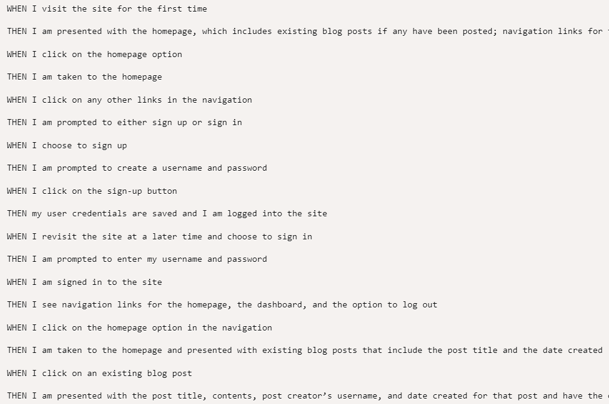

# tech-blog

## General Info
User Story: 
AS A developer who writes about tech, I WANT a CMS-style blog site SO THAT I can publish articles, blog posts, and my thoughts and opinions.

### Acceptance Criteria

## Tools Used
This project used node, javascript, express, handlebars, express-session, connect-session-sequelize, mysql, dotenv, bcrypt, and sequelize.

## Installation
Clone the repository from Github and perform npm install for all of the necessary dependencies.

## Usage
Make sure to have the npm packages installed

Include mysql username and password into .env file

Sign in to mysql and make sure to: USE tech_blog_db and: source db/schema.sql

Seed blog with: npm run seed

Running node server should run the server on localhost:3001

## Screenshots

## Links
Github repository: https://github.com/hvphan1993/tech-blog.git

Application Link: https://hvphan1993.github.io/tech-blog/